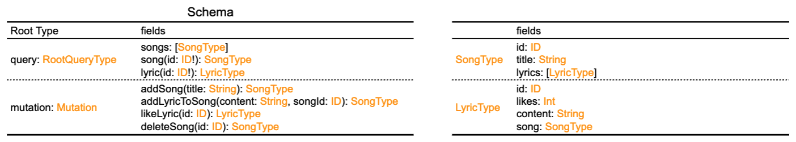
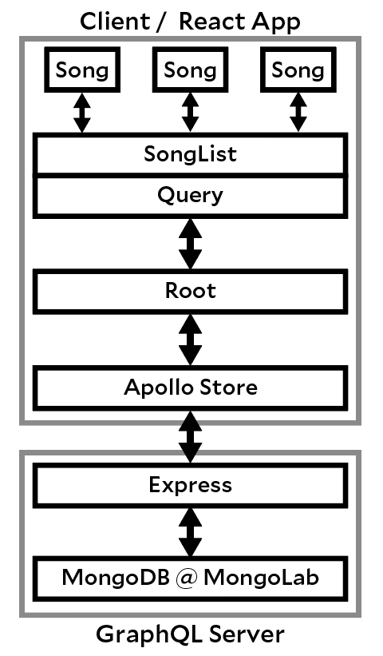
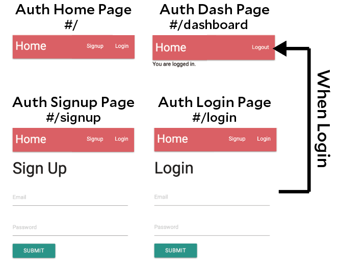
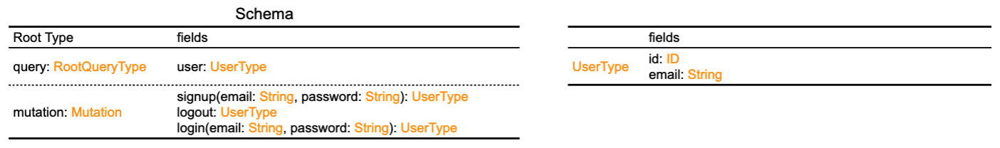

このRepositoryはGraphQLを勉強するために行なった開発をまとめたものです。

# GraphQLとReactを使用した歌詞アプリ

GraphQLを使用してバックエンドサーバーを構築し、Reactを使用してフロントエンドアプリケーション。バックエンドの認証、Apolloデータの管理、Reactとの統合、そして応答性の高いアプリケーションの構築の実践。音楽リスト一覧表示ページを「/」に、詳細ページを「/songs/{songId}」に、音楽作成ページを「/songs/new」に割り当てるアプリケーション。


### GraphQL schema


### Application Architecture


### セットアップ

1. プロジェクトのルートで以下のコマンドを実行して依存関係をインストールします。

    ```bash
    $ npm install --legacy-peer-deps
    ```

2. ブラウザで `localhost:4000` にアクセスしてアプリケーションにアクセスします。

3. MongoDBを使用するので、`./server/server.js`内の接続情報を自分のMongoDB情報に変更してください。

    ```javascript
    const MONGO_URI = 'your-mongodb-connection-uri';
    ```
4. 実行
    ```bash
    $ npm run dev
    ```

# authGraphQL
まだ未実装ですが歌詞アプリに認証機能を追加するために、GraphQLでの認証を試しました。

## Reactを使用したGraphQLを使ったauthアプリ

GraphQLを使用してバックエンドサーバーを構築し、ReactとGraphQLを使ったauth機能の構築。



### GraphQL schema


### Application Architecture
appGraphQL と同様な構造

### セットアップ

1. プロジェクトのルートで以下のコマンドを実行して依存関係をインストールします。

    ```bash
    $ npm install --legacy-peer-deps
    ```

2. ブラウザで `localhost:4000` にアクセスしてアプリケーションにアクセスします。

3. MongoDBを使用するので、`./server/server.js`内の接続情報を自分のMongoDB情報に変更してください。

    ```javascript
    const MONGO_URI = 'your-mongodb-connection-uri';
    ```
4. 実行
    ```bash
    $ npm run dev
    ```

# miniGraphQL
GraohiqlでのGraphQLの使用方法を確認

1. プロジェクトのルートで以下のコマンドを実行して依存関係をインストールします。

    ```bash
    $ npm install --legacy-peer-deps
    ```
2. ブラウザで `localhost:4000/graphql` にアクセスしてアプリケーションにアクセスします。

3. 実行
    ```bash
    $ npm run dev
    $ npm run json:server
    ```

### Open
```
http://localhost:4000/graphql
```